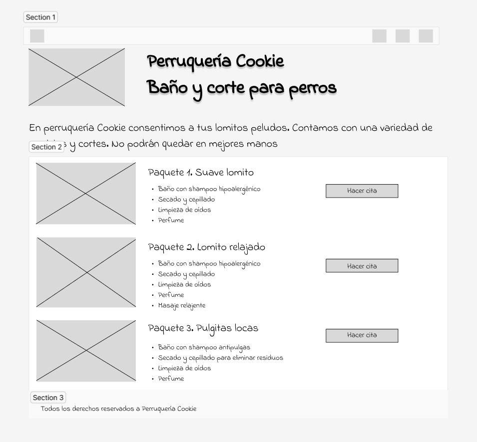

# Crear un wireframe 

Tomando como base el benchmark de e-commerce realizado con el docente, donde pudiste identificar las principales partes del diseño, te proponemos crear tu wireframe en papel donde puedas plasmar lo principal de la información recopilada. Una vez terminado, te invitamos a que subas una foto de tu trabajo a Discord. 

**RESULTADO**

Nota: el wireframe fue creado usando la herramienta de diseño llamada Figma.