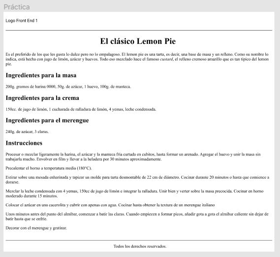
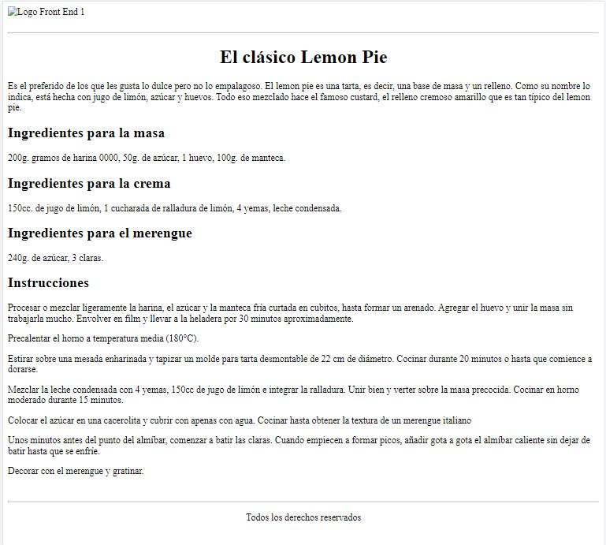

# Convertir el diseño realizado en Figma en una maqueta

Utilizando el siguiente diseño de figma como fuente de datos, la idea será reconocer cuáles
podrían ser los diferentes elementos o etiquetas que corresponden a ese resultado visual.
Una vez hecho esto, tu tarea será trasladar aquello que idearon utilizando etiquetas
HTML.

**Archivo de Figma**

**RESULTADO**

