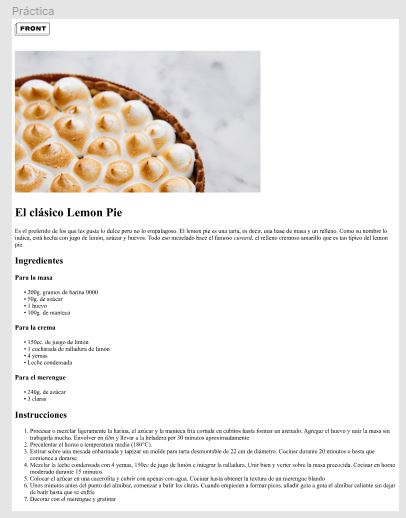
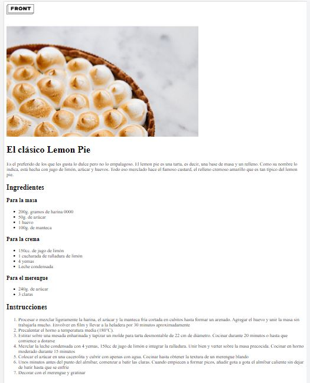

# Receta de Pay de Limón - Momento de maquetado

Utilizando del siguiente figma, la idea será reconocer cuáles podrían ser los diferentes
elementos o etiquetas que corresponden a ese resultado visual. Una vez hecho esto,
su tarea será trasladar aquello que idearon utilizando etiquetas HTML.

**PRÁCTICA EN FIGMA**

**RESULTADO**
