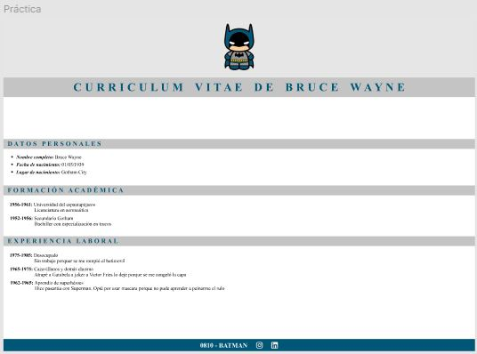
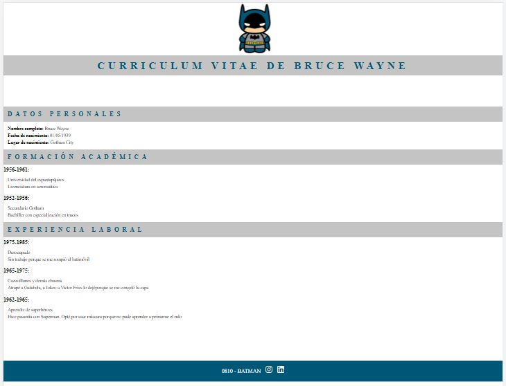

# Momento de maquetado

Utilizando el siguiente figma de referencia, los pasos para realizar la tarea serán:
1. Reconocer cuáles podrían ser los diferentes elementos o etiquetas que
corresponden a ese resultado visual;
2. Crear la estructura de carpetas necesaria;
3. Trasladar la idea a una maqueta utilizando etiquetas HTML;
4. Aplicar estilos CSS para mejorar la estética del trabajo;

**PRÁCTICA DE FIGMA** 

**RESULTADO**
