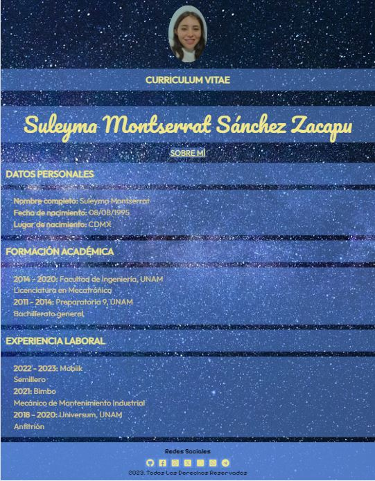
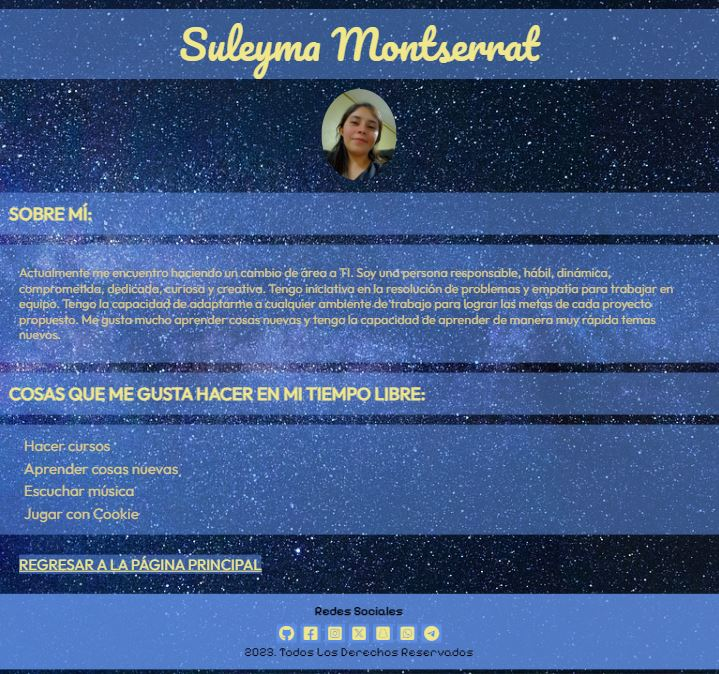

# CV Personal - Momento de maquetado

Utilizando el figma de la práctica pasada como referencia, realizar un CV personal y una página de presentación. La tarea incluirá dos páginas:

1. La página principal index.html con:
banner de cabecera con imagen de fondo
foto personal
menú con enlace externo a otro sobre-mi.html
cambiar la tipografía
footer con íconos de redes sociales, agregar github y enlazar

2. La página sobre-mi.html con:
menú con enlace externo a otro index.html
crear una sección con párrafos contando sobre ustedes

**RESULTADO**

**index.html**

**sobre-mi.html**
