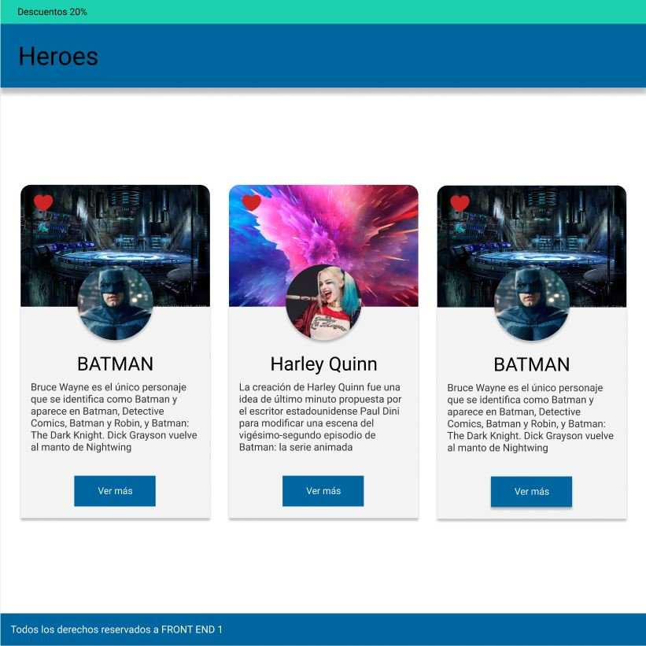
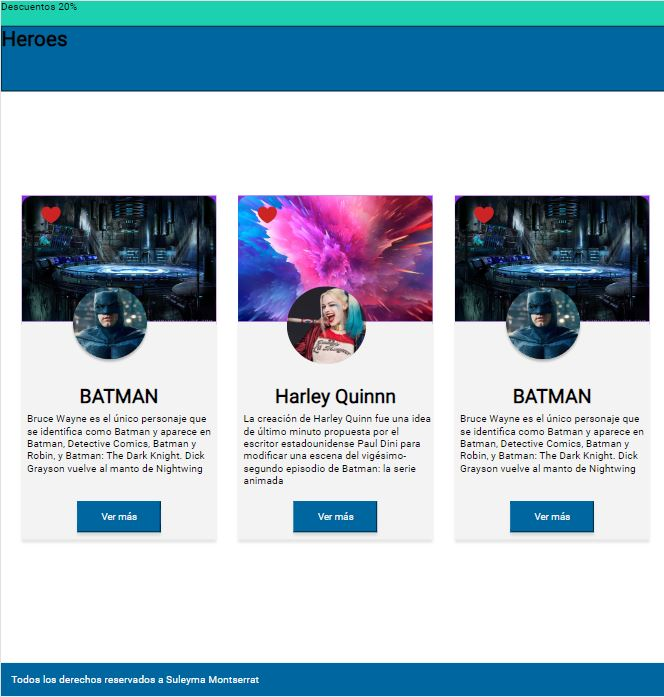
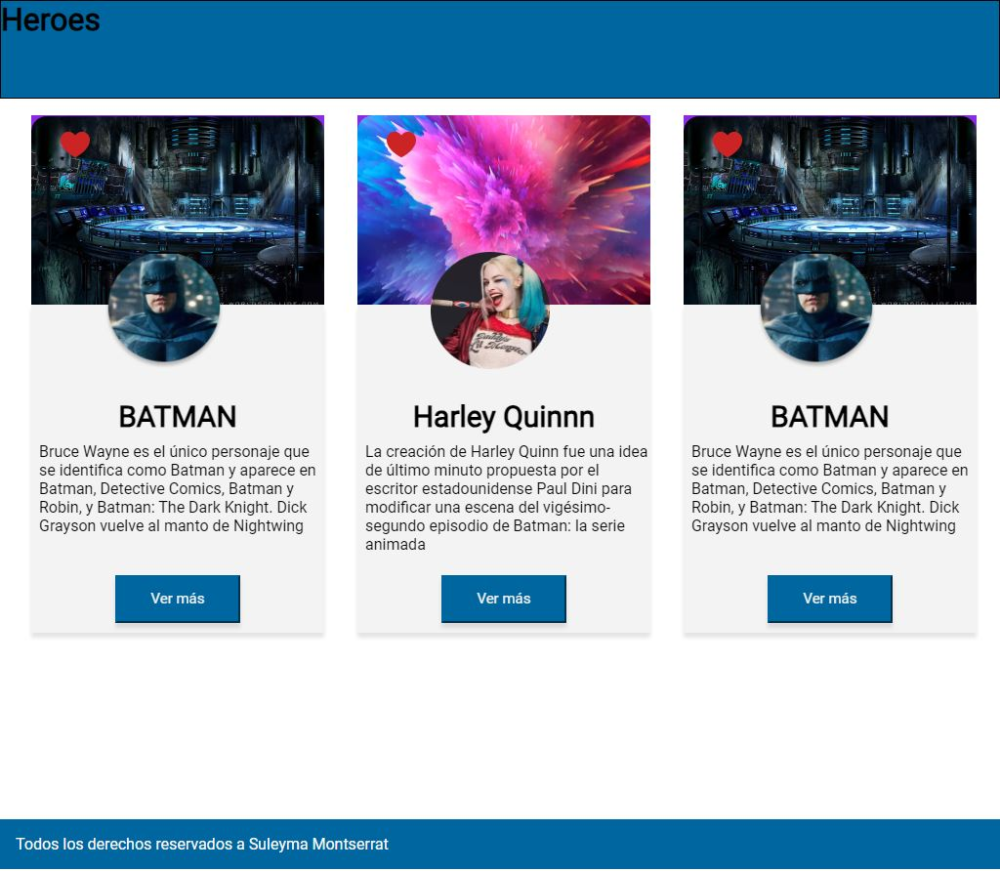

# Cards - Momento de maquetado

Utilizando el figma como referencia, revisa los diferentes elementos y estilos que corresponden a ese resultado visual y maquétalo.

Por el momento usaremos las propiedades del modelo de cajas vistas en clase para poder maquetarlo. La barra azul del Header deberá quedar fija en la parte superior al hacer scroll en la página.

**Figma**

**RESULTADO**

Heroes con sticky

